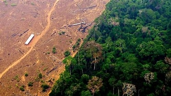
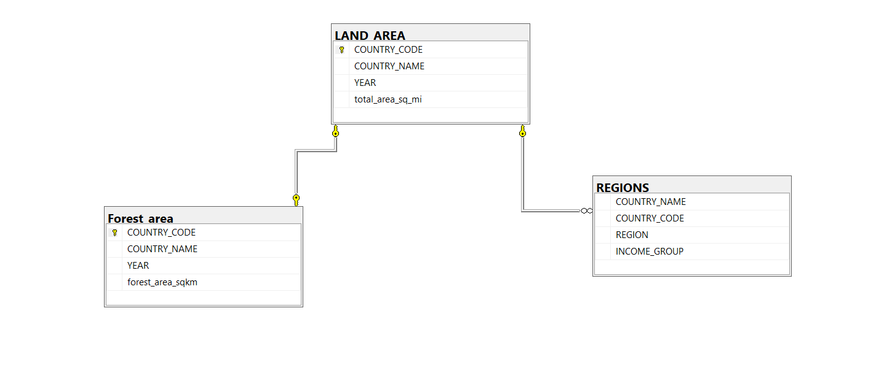
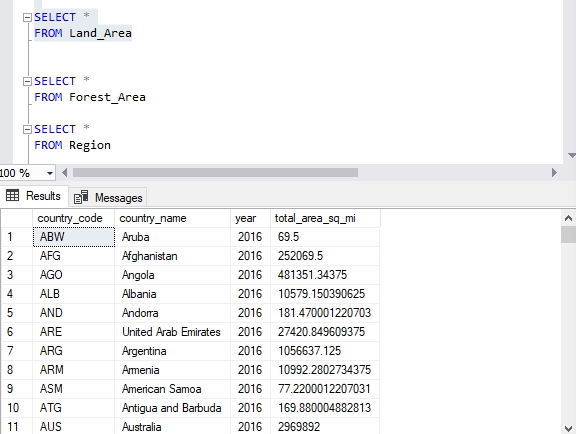
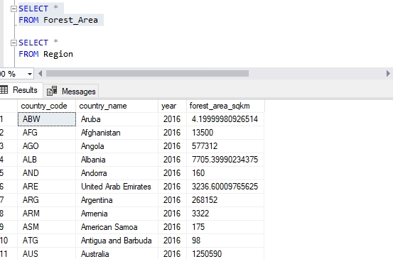
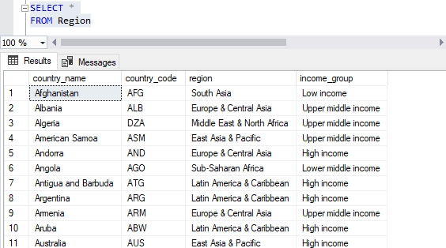
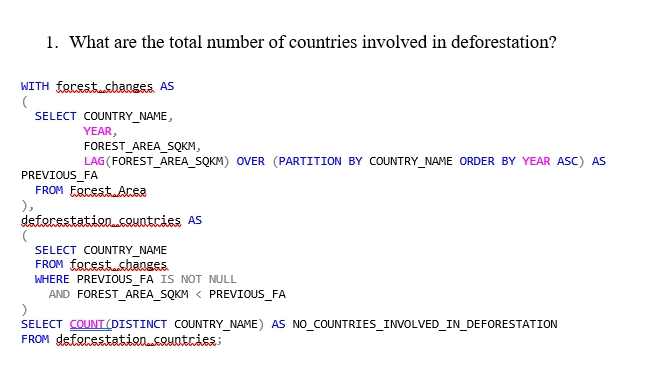
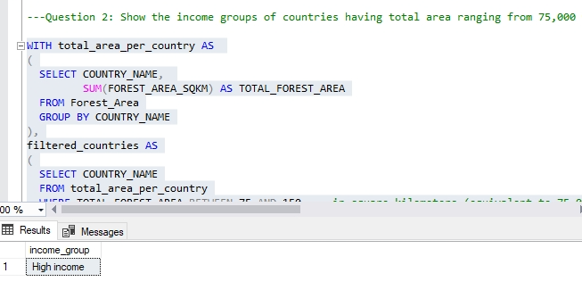
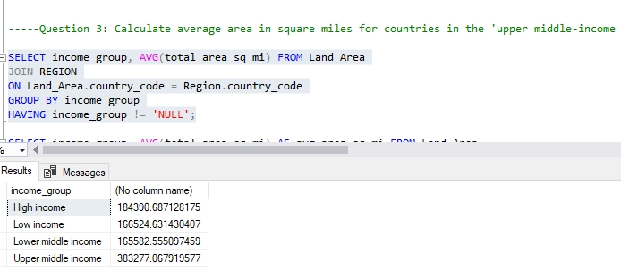
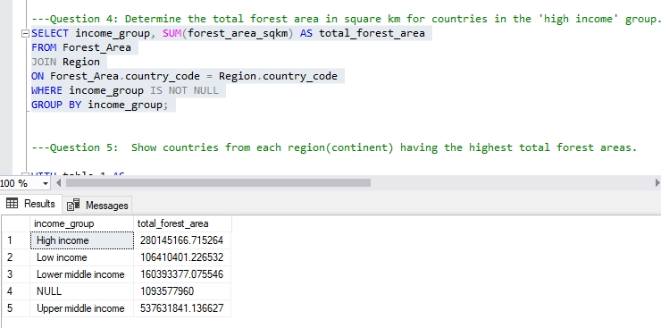
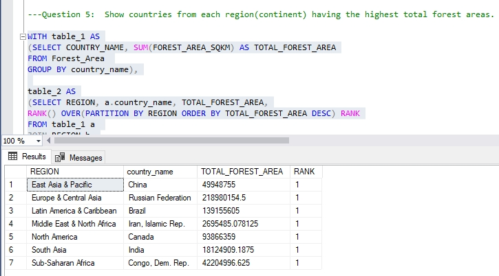

# Analysis-using-SQL

## Introduction
The knowledge of SQL is applied in this deforestation analysis.

## Problem Statement
1.	What are the total number of countries involved in deforestation? 
2.	Show the income groups of countries having total area ranging from 75,000 to 150,000 square meter?
3.	Calculate average area in square miles for countries in the 'upper middle-income region'. Compare the result with the rest of the income categories.
4.	Determine the total forest area in square km for countries in the 'high income' group. Compare result with the rest of the income categories.
5.	Show countries from each region(continent) having the highest total forest

## Skills demonstrated
1.	SQL joins and multi-table operations.
2.	Aggregating data with SUM() and AVG().
3.	Grouping data with GROUP BY.
4.	Using WHERE and HAVING for filtering data.
5.	Window functions (LAG()) for analyzing sequential data.
6.	Handling NULL values and performing conditional logic.
7.	CTEs to improve query structure and readability.

## Data sourcing
An imaginary deforestation data set

## Modelling

## Analysis
The codes below displayed all information regarding land_area, forest_area and region.
SELECT *
FROM Land_Area

SELECT *
FROM Forest_Area

SELECT *
FROM Region

## Question 1: What are the total number of countries involved in deforestation? 
WITH forest_changes AS 
(
  SELECT COUNTRY_NAME, 
         YEAR, 
         FOREST_AREA_SQKM,
         LAG(FOREST_AREA_SQKM) OVER (PARTITION BY COUNTRY_NAME ORDER BY YEAR ASC) AS PREVIOUS_FA
  FROM Forest_Area
),
deforestation_countries AS 
(
  SELECT COUNTRY_NAME
  FROM forest_changes
  WHERE PREVIOUS_FA IS NOT NULL
    AND FOREST_AREA_SQKM < PREVIOUS_FA
)
SELECT COUNT(DISTINCT COUNTRY_NAME) AS NO_COUNTRIES_INVOLVED_IN_DEFORESTATION
FROM deforestation_countries;

## Question 2: Show the income groups of countries having total area ranging from 75,000 to 150,000 square meter?

WITH total_area_per_country AS 
(
  SELECT COUNTRY_NAME, 
         SUM(FOREST_AREA_SQKM) AS TOTAL_FOREST_AREA
  FROM Forest_Area
  GROUP BY COUNTRY_NAME
),
filtered_countries AS
(
  SELECT COUNTRY_NAME
  FROM total_area_per_country
  WHERE TOTAL_FOREST_AREA BETWEEN 75 AND 150  -- in square kilometers (equivalent to 75,000 to 150,000 square meters)
)
SELECT DISTINCT Region.income_group
FROM filtered_countries
JOIN Region
ON filtered_countries.COUNTRY_NAME = Region.COUNTRY_NAME;

## Question 3: Calculate average area in square miles for countries in the 'upper middle-income region'. Compare the result with the rest of the income categories.

SELECT income_group, AVG(total_area_sq_mi) FROM Land_Area
JOIN REGION
ON Land_Area.country_code = Region.country_code
GROUP BY income_group
HAVING income_group != 'NULL';

SELECT income_group, AVG(total_area_sq_mi) AS avg_area_sq_mi FROM Land_Area 
JOIN Region
ON Land_Area.country_code = Region.country_code
WHERE income_group IS NOT NULL
GROUP BY income_group;

## Question 4: Determine the total forest area in square km for countries in the 'high income' group. Compare result with the rest of the income categories.
SELECT income_group, SUM(forest_area_sqkm) AS total_forest_area
FROM Forest_Area
JOIN Region
ON Forest_Area.country_code = Region.country_code
WHERE income_group IS NOT NULL
GROUP BY income_group;

## Question 5:  Show countries from each region(continent) having the highest total forest areas.

WITH table_1 AS
(SELECT COUNTRY_NAME, SUM(FOREST_AREA_SQKM) AS TOTAL_FOREST_AREA
FROM Forest_Area 
GROUP BY country_name),

table_2 AS
(SELECT REGION, a.country_name, TOTAL_FOREST_AREA,
RANK() OVER(PARTITION BY REGION ORDER BY TOTAL_FOREST_AREA DESC) RANK
FROM table_1 a 
JOIN REGION b 
ON a.country_name = b.country_name)

SELECT * FROM table_2 WHERE RANK = 1 AND REGION != 'WORLD'

